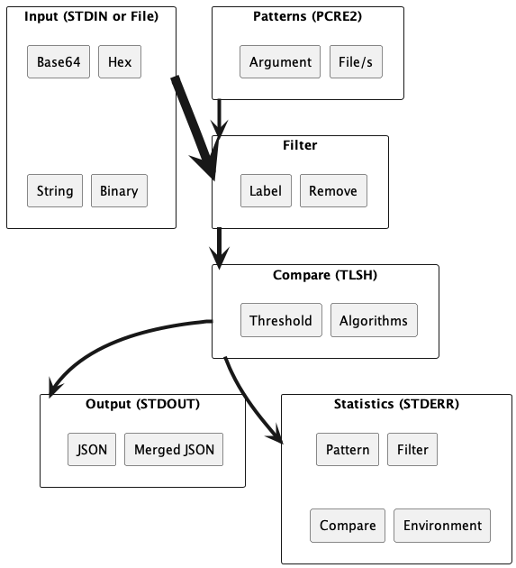

# THIS IS UNDER CONSTRUCTION IGNORE ALL GROSS STUFFS

# precursor

`precursor` is a command-line tool for searching files and directories using regular expressions. It supports searching against a rules file with named rules/patterns and outputting each match with both the name of the rule and the matched bytes. It also supports searching against a single pattern in the named format and optionally reading from STDIN for the input to search against. Additionally, it can output matches in JSON format and optionally summarize the matches by rule name and count.

## TODO
 1. Better comments and documentation
 2. Maybe support PCAP with some mechanism that parses the PCAP into some consistent newline structure for specific protocols?
 3. Add a mode to disable pattern matching, which could just essentially inject a `(?<all>.*)` pattern but that may be much slower.
 4. Add a training mode that uses a sample to find the optimal TLSH algorithm and distance for finding similairites within the supplied input.
 5. Add support for binary inputs
 6. Add support for processing entire input vs newline split (requirement for binary input)
 7. Use roaring bitmap for persistance
 8. Add ability to mask chunks based on a pattern for TLSH/FBHash
 9. Some very basic tests
 10. Refactor things so that CLI is isolated from using `precursor` as a library

## Installation

To install `precursor`, you need to have Rust installed on your system. You can download and install Rust from the official website[1]. Once Rust is installed, you can install `precursor` using the following command:

cargo install precursor

This will download and install the latest version of `precursor` from the official Rust package registry.

## Usage

To use `precursor`, run the following command:

precursor <pattern> <filename>

Replace `<pattern>` with the pattern to search for in the named format, and `<filename>` with the name of the file to search in. For example:

precursor "rule1:foo\d+" input.txt

This will search for the specified pattern in the input file and output the matches to the console.

Alternatively, you can run `precursor` with the `-p` flag to specify a pattern file in the named format:

precursor -p pattern.txt input.txt

Replace `pattern.txt` with the name of the pattern file.

By default, `precursor` outputs JSON with the rule name and the match value. You can use the `--only-matches` flag to output only the matching string along with the rule name it matched on. You can use the `--json` flag to output a single JSON file summarizing just the rule name and match counts. For example:

precursor "rule1:foo\d+" input.txt --only-matches --json > output.json

This will search for the specified pattern in the input file with the specified options and output the results to a file named `output.json`.

## License

`precursor` is licensed under the MIT license. See the LICENSE file for more information.

## Acknowledgements

`precursor` is inspired by various Rust command-line tools and libraries, including `ripgrep`, `grep`, and `pcre2`. Special thanks to the Rust community for creating and maintaining these amazing tools and libraries.

## Contributing

If you find a bug or have a feature request, please open an issue on the GitHub repository[2]. Pull requests are also welcome!
